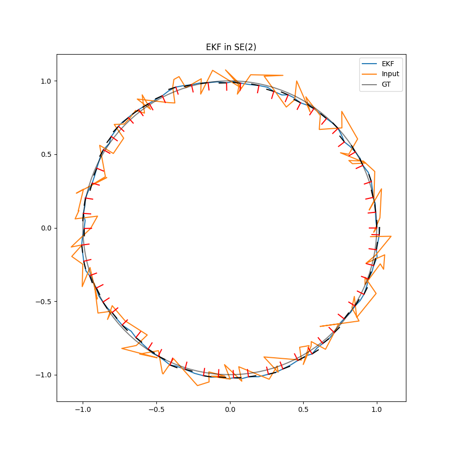
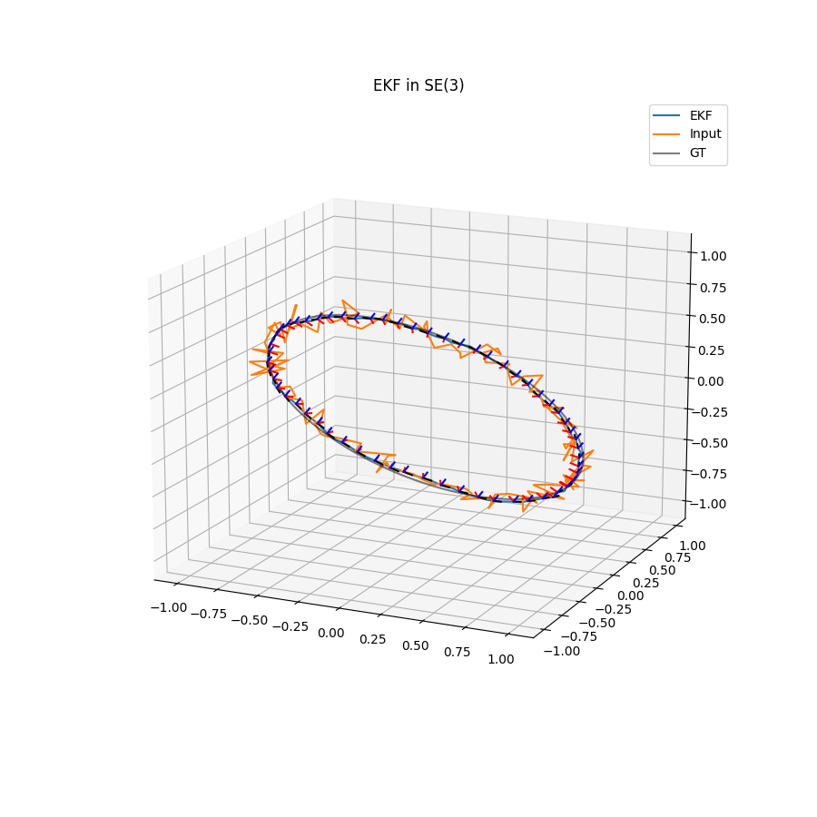
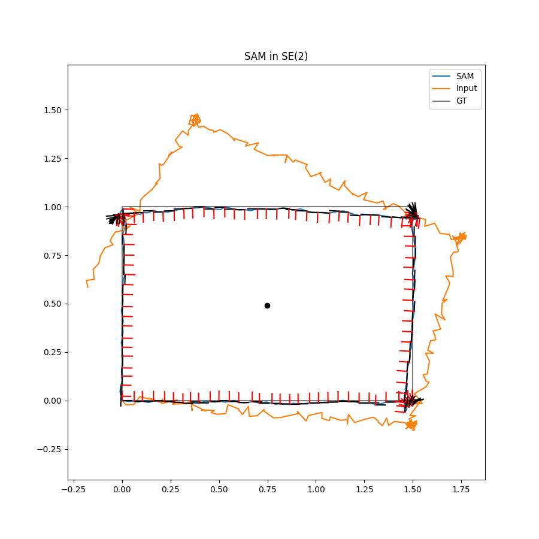
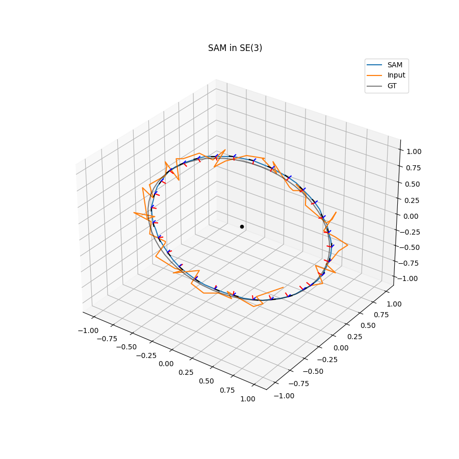

# Extended Kalman Filter, Smoothing and Mapping in Lie Algebra

__Under Construction__

The solver for EKF and SAM (Smoothing and Mapping).
It is based on [manif](https://github.com/artivis/manif) and its examples.

The library [manif](https://github.com/artivis/manif) is introduced in "[A micro Lie theory for state estimation in robotics](https://arxiv.org/abs/1812.01537)" which provides a clear explanation of lie algebra for robotics.

> manif is a Lie theory library for state-estimation targeted at robotics applications. It is developed as a header-only C++11 library with Python 3 wrappers.

## Features

- EKF, SAM Class for SE(2), SE(3)

## Dependencies

- [manif](https://github.com/artivis/manif) ([MIT license](https://github.com/artivis/manif/blob/devel/LICENSE))
- numpy
- scipy
- matplotlib

## How to Use

- git clone this repository
- run test programs in playground directory
- (the solvers are in playground/solver directory)

The programs show filtered poses.

__EKF__

__SAM__ with loop closure.

